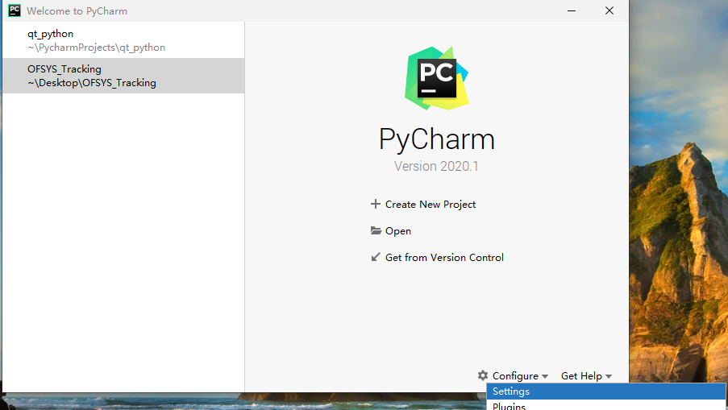
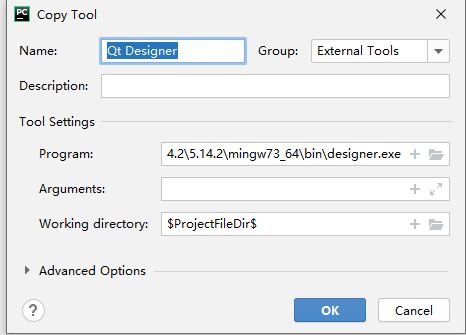
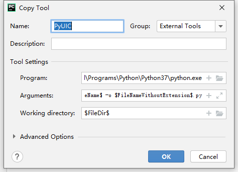
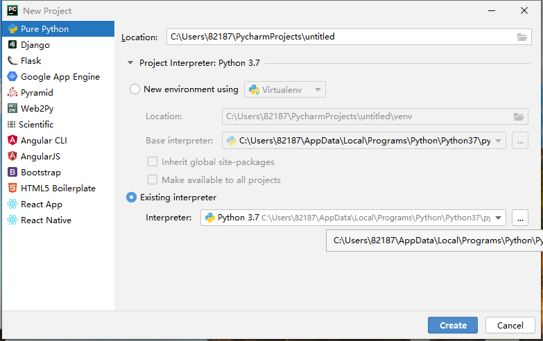
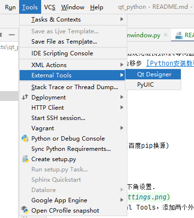
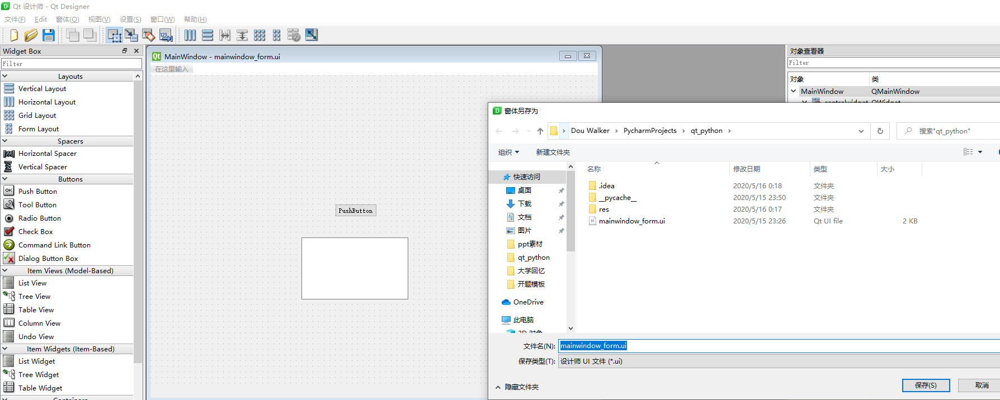
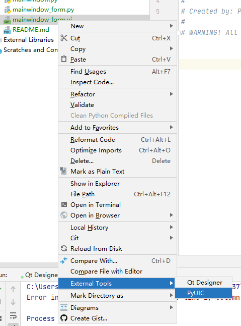

# Qt-Python (Window 10, Pycharm, python 3.7, Qt 5)
## 环境配置
### 配置Qt-Python
1. 安装Qt. 不会移步[Qt安装教程](https://www.cnblogs.com/arxive/p/11669034.html)
（建议安装时全选，不然会出现无法找到Kit等问题）
2. 安装Python3.7. 不会移步 [Python安装教程](https://www.cnblogs.com/lvtaohome/p/11121377.html)

### 安装pyqt5
在命令行安装pyqt5
```bash
pip install pyqt5
```

* 如果下载缓慢可以换源 (百度pip换源)

### 配置Pycharm

1. 打开Pycharm，选择右下角设置.

2. 选择Tools->External Tools，添加两个外部工具. Qt Creator 和 PyUIC. Qt Creator 用来创建界面的.ui文件，PyUIC用来把.ui文件自动生成为.py文件

两个工具的配置如下：



Qt_creator中：`$QT_PATH/[版本号]/mingw_[版本号]/bin/designer.exe`,Working Directory: `$ProjectFileDir$`



PyUIC中Program：`$PYTHON_PATH/python.exe`, Arguments: `-m PyQt5.uic.pyuic $FileName$ -o $FileNameWithoutExtension$.py`, Working Directory: `$FileDir$`

### 简单的实例

* 打开Pycharm创建一个项目, 记得选择合适的解释器（就是安装了Pyqt5的那个）



* 利用External Tools 打开 Qt Creator



* 在Qt Creator中随意拖出两个控件. 把文件保存在项目的根目录下



* 选中刚刚创建的UI文件，然后使用External Tools，自动生成.py文件



* 这样就完成了利用Qt Creator 在Python中编写Qt界面了